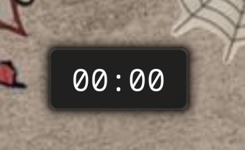
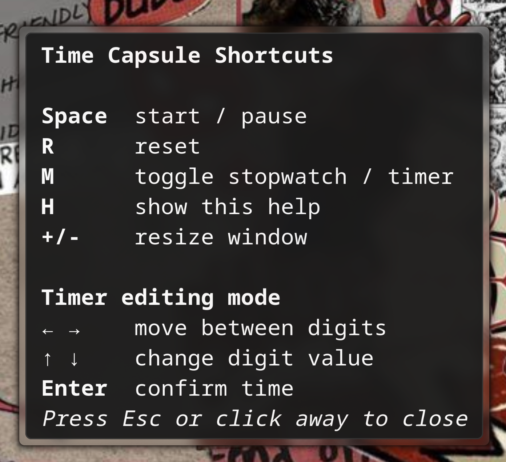

# Time Capsule

<p>
  
  
  
  
</p>

A tiny always-on-top GTK stopwatch and countdown timer that stays out of your way.

<p>
  
  
</p>

---

## Install

**From AUR:**

```bash
yay -S time-capsule
```

AUR page: https://aur.archlinux.org/packages/time-capsule

---

## Usage

Launch from your app launcher by searching **Time Capsule**, or run `time-capsule` in terminal.

### Shortcuts

| Key | Action |
|-----|--------|
| `Space` | Start / Pause |
| `R` | Reset |
| `M` | Toggle Stopwatch / Timer mode |
| `H` | Show help |
| `+` / `-` | Resize capsule |

### Timer mode

When switched to timer mode with `M`, the digits become editable:

| Key | Action |
|-----|--------|
| `← →` | Move between digits |
| `↑ ↓` | Change digit value |
| `Enter` | Confirm and arm timer |
| `R` | Go back to editing |

---

## Dependencies

- `python`
- `python-gobject`
- `gtk3`